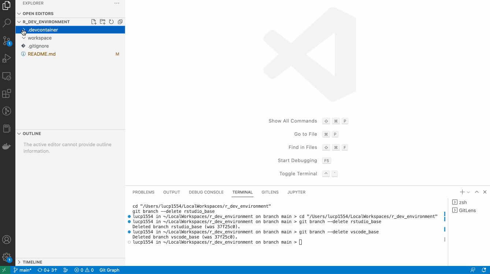

# Containerized R Development Environment

This GIT repo is a git template that provides a containered R Development environment. If you want to start a new R development git project, starts your git repo from this template and you can easily define the development environment. 

## Properties
This templates allows you to:

- Do your R development in VSCode
- Define the R packages that need to be available as part of the development environment. You can do this by setting the RPACKAGES property (in the .devcontainer/.env file).
- Switch between a development environment with or without RStudio
- Git works both within the development container as outside of the container.

## Benefits
Using a containerized R Development:
- allows you to work together with other developers on the same project, ensuring that you all have the same development environment
- allows you to easily define a development context which matches the production setting
- allows you to define separate development contexts for different r projects

## Usage
After creating a git repo from this template, one must first define which R packages should be available by default in the development environment (you can always install new ones afterwards from within the environment). By default, the packages 'tidyverse' and 'bupaverse' are pre-installed.

Next, you have to decide whether you would like to develop in VSCode or in RStudio. To do so, make sure you uncomment the correct service in ``devcontainer.json``

If you do your development in VSCode, you can use the Fish shell for your regular terminal or the R terminal for working R. Use the workspace folder for your R code.

Alternatively, you could also select RStudio as your development environment. For this you have to change the selection in ``devcontainer.json`` and start the container.

Once you have started the RStudio version, you can access an RStudio environment through your browser at ``127.0.0.1:8686``. Login is your local username. The password is ``rstudio``.

Once you are done, you can leave the development container and all your work is accessible in the workspace folder locally (on your local environment, not within the container).

